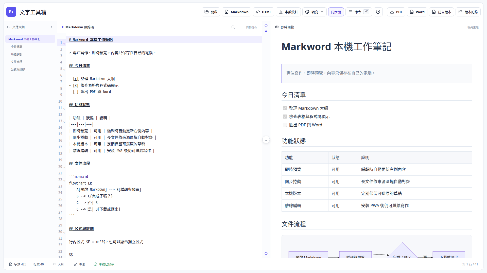

# Markword

Markword 是以 FastAPI 與 React/Vite 建構的文字統計及 Markdown 編輯器。編輯器與預覽位於同一個前端應用，支援同步捲動、Mermaid、語法高亮、主題切換，以及 PDF / Word 匯出。



## 功能

- 即時統計總字數、中文字、英文單字、數字、全形標點與行數
- Markdown 即時預覽與編輯器／預覽雙向同步捲動
- 可點擊文件大綱、預覽雙擊回到原始碼、同步捲動開關
- Light、Dark、Nord、Dracula 四種主題
- 程式碼語法高亮、Mermaid、KaTeX、task list 與 footnote
- 開啟／拖放 `.md`、下載 Markdown 與可攜 HTML
- CodeMirror 搜尋、摺疊、命令選單、快捷插入、專注與打字機模式
- IndexedDB 草稿復原、每五分鐘自動版本、手動版本與非破壞還原
- 手機版編輯／預覽 tabs，以及可安裝的 PWA 離線 app shell
- 匯出 PDF 與 Word (`.docx`)
- 單一 FastAPI 程序提供 API 與正式版前端靜態檔

## 專案結構

```text
backend/             FastAPI API、統計與匯出邏輯
frontend/            React + TypeScript + Vite 前端
frontend/dist/       npm run build 的正式版產物（不提交 Git）
exports/             匯出檔案（不提交 Git）
Dockerfile           前後端 multi-stage production image
docker-compose.yml   單機容器部署範例
```

## 本機開發

需求：Python 3.10+、Node.js 20+，以及 npm。Python 套件可使用 `uv` 或 `pip` 安裝。

先安裝後端依賴並啟動 FastAPI：

```bash
uv venv
uv pip install -r requirements.txt
uv run uvicorn backend.main:app --reload --host 127.0.0.1 --port 27860
```

另開一個終端啟動前端：

```bash
cd frontend
npm install
npm run dev
```

開發介面以 Vite 顯示的網址為準（預設 `http://localhost:5173`）。`/api` 請求會由 Vite proxy 轉送到 `http://127.0.0.1:27860`，不需要另外設定 CORS。

若只需要測試 API，可開啟 `http://127.0.0.1:27860/docs`。

## 本機 production 模式

先建置前端，再由 FastAPI 同時提供 API 與靜態檔：

```bash
cd frontend
npm install
npm run build
cd ..
uv run uvicorn backend.main:app --host 0.0.0.0 --port 27860
```

瀏覽器開啟 `http://localhost:27860`。重新部署前端變更時，須再次執行 `npm run build`。

## 編輯器操作

- `Ctrl/Cmd+K`：開啟命令選單；也可在空白行輸入 `/` 快速開啟插入命令。
- `Ctrl/Cmd+F`：搜尋／取代；`Ctrl/Cmd+S`：下載目前 Markdown。
- `?`：顯示快捷鍵；`Ctrl/Cmd+Shift+F`：專注模式。
- 左側大綱可跳至標題；雙擊右側預覽區塊可回到對應原始碼。
- 工具列可開啟或拖放本機 Markdown，並下載 `.md` 或自帶樣式的 `.html`。
- 草稿存在瀏覽器 IndexedDB；內容變更後每五分鐘建立一個本機版本，最多保留 120 個。還原版本前會先備份目前內容。
- PWA 只快取編輯器／預覽所需的 app shell 與靜態資源；PDF／Word 仍由本機 FastAPI 服務產生。

## 文件更換、保存與預覽更新

Markword 目前採用「單一工作草稿」模型，適合在自己的電腦一次處理一份文件：

- 以「開啟」或拖放載入另一個 `.md`／`.markdown` 時，工作區會切換成新內容；瀏覽器不會把原始 Markdown 加入 Git，也不會上傳到外部服務。
- 目前內容會在編輯後約 350 ms 自動寫入瀏覽器 IndexedDB。內容持續變更時，每五分鐘建立一個本機版本，最多保留 120 個；還原前會先保存當下內容。
- Markdown 改變時會重新產生帶有來源起訖行的預覽區塊。表格、程式碼、圖片、Mermaid 與 KaTeX 完成排版後，預覽會重新量測高度，因此同步捲動不依賴某一份固定文件或固定行高。
- 磁碟上的原始檔若被其他程式修改，瀏覽器不會在背景持續監看；請重新開啟或拖放該檔案。若要把工作區內容寫回磁碟，使用 Markdown 下載按鈕。
- 版本記錄與目前草稿只存在該瀏覽器的本機儲存空間；清除網站資料或更換瀏覽器前，應先下載 Markdown。這不是多文件資料庫，也不會把測試文件提交到 repository。

README 的畫面示範使用另寫的通用 Markdown；實際使用者文件與瀏覽器 IndexedDB 都不屬於 repository 內容。

可用以下環境變數覆寫預設路徑：

| 變數 | 預設值 | 用途 |
| --- | --- | --- |
| `MARKWORD_FRONTEND_DIR` | `frontend/dist` | 前端正式版靜態檔目錄 |
| `MARKWORD_EXPORT_DIR` | `exports` | PDF / Word 匯出檔目錄 |
| `MARKWORD_CORS_ORIGINS` | Vite 的 localhost origins | 逗號分隔的跨來源白名單 |
| `MARKWORD_HOST` | `0.0.0.0` | 使用 `python app.py` 啟動時的監聽位址 |
| `MARKWORD_PORT` | `27860` | 使用 `python app.py` 啟動時的監聽埠 |

主要 API：

| Method | Path | 用途 |
| --- | --- | --- |
| `GET` | `/api/health` | 服務健康狀態 |
| `POST` | `/api/analyze` | 文字統計 |
| `GET` | `/api/themes` | 取得預覽主題 |
| `POST` | `/api/export/pdf` | 匯出 PDF |
| `POST` | `/api/export/docx` | 匯出 Word |

完整 request / response schema 可在 `/docs` 查看。為了讓既有啟動腳本容易遷移，`python app.py` 仍可使用，但新的部署設定建議直接指定 `backend.main:app`。

## Docker Compose 部署

```bash
docker compose up --build -d
docker compose logs -f markword
```

服務會在 `http://localhost:27860` 提供。`markword-exports` named volume 保存匯出結果；更新映像時可保留此 volume。

停止服務：

```bash
docker compose down
```

若確定不再需要匯出檔，才使用 `docker compose down -v` 一併刪除 volume。

## systemd 部署

systemd 範例假設專案已部署到 `/opt/markword`，執行帳號為 `markword`。Debian / Ubuntu 主機先安裝 Node.js、Python、`uv`，以及 WeasyPrint 所需的系統字型與函式庫，接著建立服務帳號和可寫的匯出目錄：

```bash
sudo apt install fonts-noto-cjk libcairo2 libpango-1.0-0 libpangoft2-1.0-0 shared-mime-info
sudo useradd --system --home-dir /opt/markword --shell /usr/sbin/nologin markword
sudo chown -R markword:markword /opt/markword
sudo install -d -o markword -g markword /opt/markword/exports
```

若 `markword` 帳號已存在，略過 `useradd`。再建立 production build 與 Python 虛擬環境：

```bash
cd /opt/markword/frontend
sudo -u markword npm install
sudo -u markword npm run build
cd /opt/markword
sudo -u markword uv venv
sudo -u markword uv pip install -r requirements.txt
sudo install -m 0644 markword.service.example /etc/systemd/system/markword.service
```

若路徑或帳號不同，請先修改 `/etc/systemd/system/markword.service`，然後啟用服務：

```bash
sudo systemctl daemon-reload
sudo systemctl enable --now markword
sudo systemctl status markword
```

更新程式時重新建置前端、更新 Python 依賴，再重啟：

```bash
cd /opt/markword/frontend && sudo -u markword npm install && sudo -u markword npm run build
cd /opt/markword && sudo -u markword uv pip install -r requirements.txt
sudo systemctl restart markword
```

若要直接公開到網際網路，建議在 FastAPI 前方放置 Caddy 或 Nginx，負責 TLS、網域與請求大小限制；Uvicorn 維持監聽 loopback，再由 reverse proxy 轉送。

## 測試與檢查

```bash
pytest
cd frontend
npm run lint
npm run build
```

舊版 Gradio 的畫面截圖保留於 `assets/`，僅供遷移前後對照。

## License

[MIT](LICENSE)
