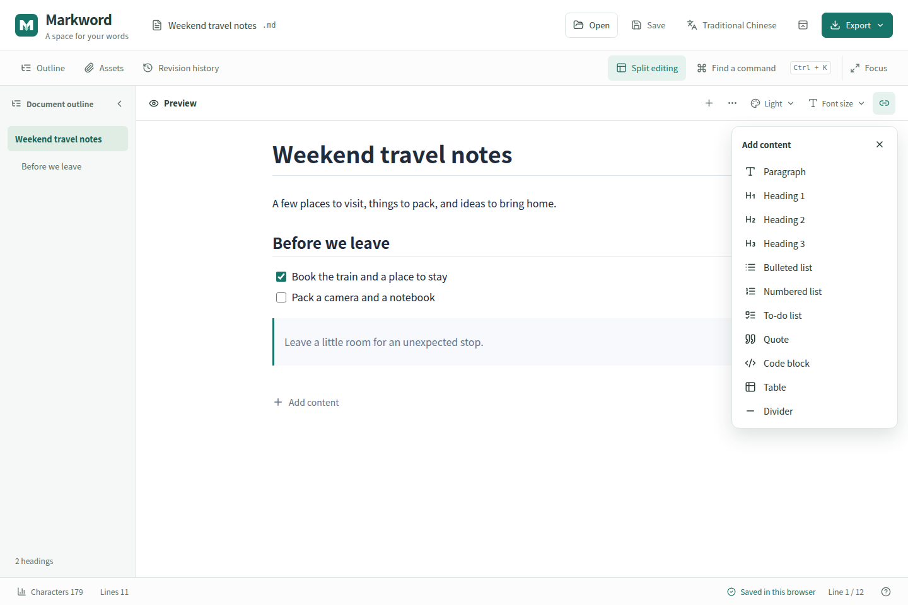
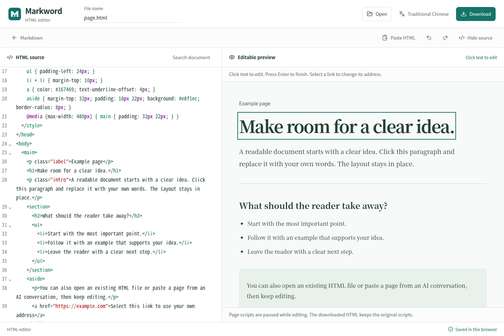

# Markword

**English** | [繁體中文](README.zh-TW.md)

Markword is a browser-based Markdown and HTML editor. Write Markdown directly in an editable preview, add content with a block menu, or keep the source beside your document. The separate HTML workspace lets you open a page and change its text and links without writing HTML.


## Features

- **Single-page writing**: edit text in place, press Enter to keep writing, and use `/` or **Add content** for headings, lists, quotes, code, tables, and dividers.
- **Source and preview together**: switch to split editing with synchronized scrolling, a document outline, and search. Both views edit the same document and share undo/redo.
- **HTML editing**: open or paste HTML, click to change text and links, and download the edited page with its original styles.
- **Rich content**: editable code blocks with syntax highlighting, task checkboxes, a table editor, Mermaid diagrams, and math.
- **Import and export**: open Markdown, text, Mermaid, HTML, Word (`.docx`), and project ZIP files. Export Markdown, portable HTML, or project ZIP; the full edition also exports PDF and Word.
- **Drafts and backups**: automatic browser drafts, Markdown revision history, and project backups with referenced attachments.
- **Workspace controls**: a collapsible toolbar, eight preview themes, focus mode, word counts, mobile layouts, and English/Traditional Chinese interfaces.

## Get started

You need Git, Docker, and Docker Compose. This repository is available for viewing and evaluation only; obtain the author's prior written permission before running or deploying it.

```bash
git clone https://github.com/susuky/markword.git
cd markword
docker compose up --build -d
```

Once the build finishes, open [http://localhost:27860](http://localhost:27860). The first start downloads and installs the required packages. Run `docker compose down` to stop the service.

For installation without Docker, see the [local installation and deployment guide](docs/development.md) (Traditional Chinese).

### Full edition and Pages edition

| Feature | Local full edition | Pages edition |
| --- | --- | --- |
| Single-page / split editing, diagrams, and math | Supported | Supported |
| HTML source and visual text editing | Supported | Supported |
| Browser drafts, revisions, and attachments | Supported | Supported |
| Markdown, portable HTML, and project ZIP | Supported | Supported |
| Direct PDF / Word export | Supported | Unavailable |

In the Pages edition, download portable HTML and use your browser to print it as PDF. Use the local full edition for direct PDF or Word export. See the [deployment guide](docs/development.md#github-pages-建置) for Pages configuration and publishing.

## Writing and editing

### Markdown: single-page or split editing

Click **Open**, drop a document into the workspace, or start writing. In this workspace, HTML and Word files convert to Markdown; review the result because complex layouts may change.

The preview is editable by default. On desktop, click **Single-page editing** to hide the source, or **Split editing** to bring it back. On mobile, use the **Editor** and **Preview** tabs. The toolbar button beside **Export** collapses or expands the workspace tools and remembers your choice.



| To… | In the preview… |
| --- | --- |
| Write or change text | Click a paragraph or heading and type; empty documents are editable too |
| Continue writing | Press `Enter` for a new paragraph or list item; press `Enter` on an empty item to leave the list |
| Insert a block | Type `/` on an empty line or click **+** above the preview to open **Add content** |
| Insert between blocks | Use the **+** beside a block to insert after it; **Add content** at the bottom continues the document |
| Edit code | Click the code block; type or paste multiple lines, then press `Escape` or `Ctrl/Cmd+Enter` to finish |
| Edit links, tasks, or tables | Select a link to change its address, toggle a checkbox, or choose **Edit table** to change cells, rows, and columns |
| Undo or redo | Open the **…** preview tools menu |

The block menu includes paragraphs, three heading levels, bulleted/numbered/task lists, quotes, code, tables, and dividers. Paste or drop images and attachments into the workspace to add them.

Edits update the same source and browser draft. Code highlighting returns when you leave a code block. Blocks containing formulas, footnote references, or media still use the source editor. Editing a block in the preview may normalize its Markdown, including list indentation, emphasis markers, or reference links; other blocks keep their original source.

### Edit HTML without writing markup

Choose **HTML editor** from the **Markdown** menu above the source pane in split view, or append `#/html` to the app URL. This workspace has its own browser draft, separate from Markdown.

1. **Open a page**: choose an `.html`/`.htm` file, or use **Paste HTML** for a complete page or fragment, including HTML from an AI conversation.
2. **Edit the preview**: click text and type, then press `Enter` to finish. Select a link to change its address. The source stays in sync; hide it on desktop or switch tabs on mobile.
3. **Download your changes**: use **Undo** or **Redo** as needed, then **Download** or `Ctrl/Cmd+S` to save an HTML file.



Original styles and scripts remain in the downloaded file, but page scripts do not run in the editing preview. You can edit static text and existing links; layout dragging, image replacement, and dynamic chart editing are not supported.

Relative-path resources are not imported with the HTML file; use embedded assets or full URLs. Visual edits may normalize markup whitespace and quoting.

Opening HTML in the Markdown workspace still converts it to Markdown. Switch to the HTML editor first to keep the page as HTML.

## Saving and exporting

In the Markdown workspace, use **Save** or `Ctrl/Cmd+S` to save the source. Browsers with direct file saving can update an opened file or let you choose a new location; other browsers download it. Use **Export** for the formats below.

| Format | Use it for |
| --- | --- |
| Markdown / text / Mermaid | Editable source; local attachments are separate |
| Project ZIP | Back up the current document and its referenced local attachments, then reopen them for editing |
| Portable HTML | Share an offline-readable document with its source and referenced local attachments |
| PDF / Word | Print or deliver a document; Word uses a fixed layout |

### Useful shortcuts

| Shortcut | Action |
| --- | --- |
| `Ctrl/Cmd+S` | Save Markdown source or download the current HTML page |
| `Ctrl/Cmd+F` | Search and replace in the Markdown workspace |
| `Ctrl/Cmd+K` | Open the Markdown workspace command palette |

### Drafts and backups

Drafts stay in the current browser; saving a draft does not update a file on your computer. Before changing devices or clearing site data:

- **Markdown**: export a project ZIP to keep the current document and its referenced local attachments. ZIPs do not include revision history or other documents.
- **HTML**: download the page from the HTML editor. Its separate draft is not included in a Markdown project ZIP.

Importing and editing happen in the browser. PDF/Word export sends the document and supported local images to the Markword service you are using. Run Markword on your own computer to keep that processing there.

## Learn more

See the [development and deployment guide](docs/development.md) (Traditional Chinese) for local development, configuration, API details, and export limits.

## Bug reports and feature suggestions

This project accepts bug reports and feature suggestions through [GitHub Issues](https://github.com/susuky/markword/issues) only. External pull requests are not accepted. The maintainer decides whether and when to address reports or adopt suggestions, and maintains and commits the code. See the [reporting guide](CONTRIBUTING.md) (Traditional Chinese) for details.

## Copyright

Third-party dependencies retain their respective licenses.

```less
Copyright © 2026 Hao-Ping Lin (@susuky). All rights reserved.

This repository is publicly accessible for viewing and evaluation only.
No license is granted to use, copy, modify, redistribute, sublicense, or use this software commercially without prior written permission.
```
