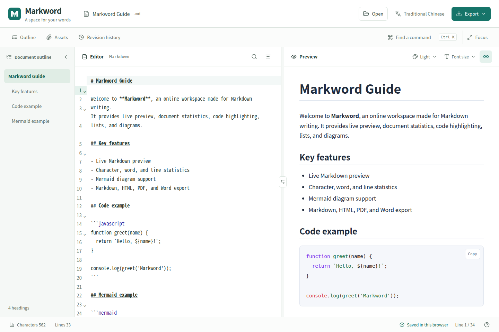

# Markword

**繁體中文** | [English](README.md)

Markword 是在瀏覽器中使用的 Markdown 編輯器，適合寫筆記、整理文件與準備報告。可以在同一處閱讀與編輯，也可以使用雙欄即時預覽；寫完後，匯出成 Markdown、HTML、PDF 或 Word。



## 主要功能

- **邊寫邊看**：單欄即時編輯、雙欄同步預覽、文件大綱與搜尋。
- **直接修改 HTML**：獨立 HTML 編輯頁，支援點選文字、修改連結、同步原始碼與下載 HTML。
- **完整呈現內容**：程式碼高亮、Mermaid 圖表、數學公式、待辦清單與視覺化表格編輯。
- **匯入既有文件**：開啟 Markdown、純文字、Mermaid、HTML、Word（`.docx`）或 Markword 專案 ZIP；圖片與附件可直接貼上或拖入。
- **保存與備份**：瀏覽器自動保存草稿、版本記錄，以及文件與附件的專案備份。
- **匯出與分享**：Markdown、可攜 HTML、PDF、Word；HTML／PDF 提供四種版型。
- **自在寫作**：八種主題、專注模式、字數統計、手機版面與繁體中文／英文介面。

## 快速開始

需要 Git、Docker 與 Docker Compose。本儲存庫僅供檢視與評估；執行或部署前須取得作者的事先書面許可。

```bash
git clone https://github.com/susuky/markword.git
cd markword
docker compose up --build -d
```

建置完成後，開啟 [http://localhost:27860](http://localhost:27860) 即可使用。第一次啟動會下載並安裝所需套件；停止服務可執行 `docker compose down`。

不使用 Docker 時，請參閱[本機安裝與部署](docs/development.md)。

### 完整版與 Pages 版

| 功能 | 本機完整版 | Pages 版 |
| --- | --- | --- |
| 編輯、預覽、圖表與公式 | 支援 | 支援 |
| HTML 原始碼與點選編輯 | 支援 | 支援 |
| 瀏覽器草稿、版本記錄與附件 | 支援 | 支援 |
| Markdown、可攜 HTML 與專案 ZIP | 支援 | 支援 |
| 直接匯出 PDF／Word | 支援 | 不提供 |

Pages 版可以先下載可攜 HTML，再透過瀏覽器列印成 PDF；需要直接匯出 PDF 或 Word 時，請使用本機完整版。Pages 的設定與發布方式請參閱[部署文件](docs/development.md#github-pages-建置)。

## 簡易用法

1. **開啟文件**：點選「開啟」，或將文件拖入畫面；也可以直接編寫新內容。HTML／Word 會轉成 Markdown，複雜版面可能改變，請檢查轉換結果。
2. **選擇寫作方式**：雙欄模式同時顯示原文與預覽；點選「單頁編輯」即可直接在預覽修改內容，點選「雙欄編輯」恢復原始碼。頂端的工具列按鈕可展開或收合工作區工具，並記住上次選擇。
3. **加入內容**：貼上或拖入圖片；在表格旁點選編輯按鈕，可調整儲存格、列與欄。空白行輸入 `/` 可快速插入常用內容。
4. **儲存與匯出**：使用「儲存」或 `Ctrl/Cmd+S` 保存原始檔；從「匯出」選擇適合的分享或備份格式。

支援直接存檔的瀏覽器可存回已開啟的原檔，或選擇新檔名與位置；其他瀏覽器會下載原始檔。

### 不寫語法也能修改 Markdown

預覽預設可直接編輯，也能從空白文件開始寫作。點選文字即可修改，按 Enter 新增段落或接續清單；空白清單項目再按 Enter 即可退出清單。空白行按 `/`，或按預覽上方的「新增內容」，可插入段落、三級標題、項目／編號／待辦清單、引用、程式碼、表格與分隔線。段落旁的「＋」可在該區塊後插入內容，頁尾也可繼續新增。選取連結可改網址，待辦清單可直接勾選；表格沿用「編輯表格」。從預覽上方的「預覽編輯工具」選單可復原、重做；桌面點選「單頁編輯」可隱藏原始碼，手機可切換「編輯／預覽」。修改會同步到原始碼、草稿與下載檔，也可用「復原／重做」還原。

程式碼區塊可直接修改、換行與貼上多行內容，按 Escape 或 Ctrl/Cmd+Enter 完成；離開區塊後恢復語法上色。含公式、註腳標記或媒體的段落／清單仍從原始碼編輯。直接修改會重新產生該區塊的 Markdown，因此清單縮排、強調符號或參照連結寫法可能調整；其他區塊保留原始文字。

### 不寫語法也能修改 HTML

在「文件模式」選單選擇「HTML 編輯器」，或在應用網址後加上 `#/html`。此頁有獨立草稿，不會取代 Markdown 工作區的文件。

1. 點「開啟」選擇 `.html`／`.htm` 檔，或用「貼上 HTML」貼入完整頁面或片段。
2. 直接點預覽中的文字修改，按 Enter 完成；選取連結後可修改網址。桌面可隱藏原始碼，手機可切換預覽與原始碼。
3. 用「復原／重做」調整修改，按「下載」或 `Ctrl/Cmd+S` 取得 HTML 檔。瀏覽器草稿與下載檔是分開的，清除網站資料前請先下載。

原有樣式與腳本保存在下載檔中，編輯預覽不執行腳本。第一版可修改靜態文字與既有連結，尚不提供拖曳排版、圖片替換或動態圖表編輯。

相對路徑的外部檔案不會隨 HTML 一起匯入；請使用內嵌資源或完整網址。視覺修改後，HTML 的空白與引號等寫法可能由瀏覽器調整。

Markdown 工作區的 HTML 匯入用途是轉成 Markdown；要保留網頁格式，請先切換至 HTML 編輯器再開啟檔案。

### 選擇匯出格式

| 格式 | 適合用途 |
| --- | --- |
| Markdown／純文字／Mermaid | 保留可編輯原文；不包含本機附件 |
| 專案 ZIP | 備份目前文件及引用的本機附件，之後可重新開啟編輯 |
| 可攜 HTML | 分享可離線閱讀的文件，內含原文與引用的本機附件 |
| PDF／Word | 列印、交付報告或文件；Word 使用固定版型 |

### 常用快捷鍵

| 快捷鍵 | 操作 |
| --- | --- |
| `Ctrl/Cmd+S` | 儲存文件 |
| `Ctrl/Cmd+F` | 搜尋與取代 |
| `Ctrl/Cmd+K` | 開啟命令選單 |

### 草稿與備份

草稿、版本記錄與匯入的附件保存在目前瀏覽器。自動保存草稿不等於存回電腦檔案；更換裝置或清除網站資料前，請匯出專案 ZIP。ZIP 不包含版本記錄或其他文件。

匯入與編輯在瀏覽器內完成；匯出 PDF／Word 時，文件與支援的本機圖片會送到你正在使用的 Markword 服務。本機部署可讓這些處理留在自己的電腦。

## 進一步了解

本機開發、部署設定、API 與匯出限制請參閱[開發與部署文件](docs/development.md)。

## 問題回報與功能建議

本專案只透過 [GitHub Issues](https://github.com/susuky/markword/issues) 接受問題回報與功能建議，不接受外部 Pull request。是否修正、何時處理及是否採納建議，由維護者決定；程式碼由維護者維護與提交。回報方式請參閱[問題回報指南](CONTRIBUTING.md)。

## 權利聲明

第三方相依套件維持各自的授權條款。

```less
Copyright © 2026 Hao-Ping Lin (@susuky). All rights reserved.

This repository is publicly accessible for viewing and evaluation only.
No license is granted to use, copy, modify, redistribute, sublicense, or use this software commercially without prior written permission.
```
